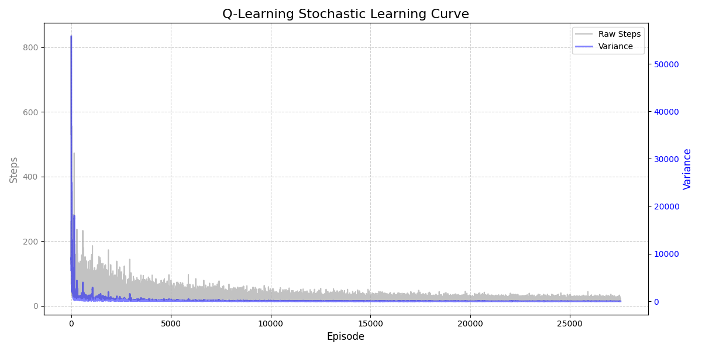

# Stochastic Q-Learning Delivery Agent

This project implements a Q-Learning agent that learns how to complete a delivery task in a stochastic grid environment. Unlike standard deterministic grid worlds, this environment incorporates uncertainty using a **Dirichlet distribution**. The probability of the agent successfully executing its intended action decreases as it approaches a designated "danger zone", simulating real-world environmental noise (e.g., slippery roads or wind).

### Environment
* **Grid:** 10x10
* **Start:** (0, 0)
* **Pickup:** (2, 4)
* **Drop-off:** (8, 9)
* **Danger Zone Center:** (8, 7)
* **Transition Dynamics:** Stochastic. Action probabilities are calculated using the Manhattan distance to the danger zone center.

### Actions
**Intended Actions (Agent):**
* 0: Up
* 1: Down
* 2: Left
* 3: Right

**Actual Actions (Environment - 9-way movement):**
Based on the Dirichlet probability array, the environment can execute 9 different actions: the 4 main directions, 4 diagonal directions, and 1 stay (no-movement) action.

### Rewards
* **Standard Step / Stay:** -1
* **Invalid move (Boundary hit):** -10
* **Pickup:** +20
* **Delivery:** +100

### Agent
* **Algorithm:** Q-Learning
* **Alpha (Learning Rate):** 0.1
* **Gamma (Discount Factor):** 0.95
* **Exploration:** Epsilon-greedy with dynamic decay

### Convergence
Because the environment is stochastic, raw step counts are inherently noisy. Convergence is dynamically detected using:
* **Variance** of recent steps (Threshold: <= 1.0)
* **Moving Average** change (Threshold: <= 0.5)

This dual-check ensures the agent has truly reached a stable, optimal policy despite the environmental randomness.

### Learning Curve
<p align="center">
  
</p>
The dual-axis graph visualizes the learning progress. It plots the raw, noisy steps taken per episode alongside the rolling variance, perfectly demonstrating the agent's convergence toward a stable policy.

### Run
Train the agent:
```bash
python main.py
